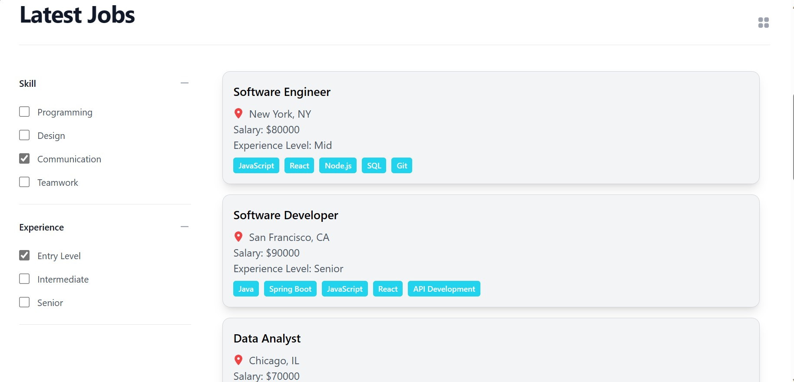
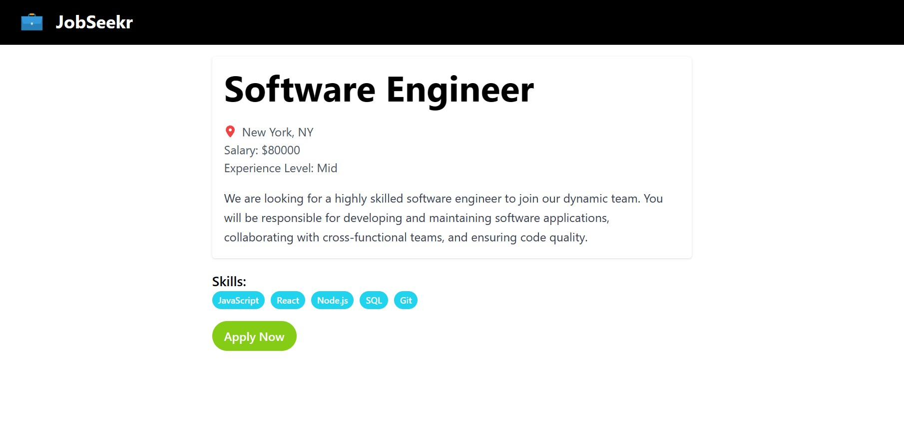
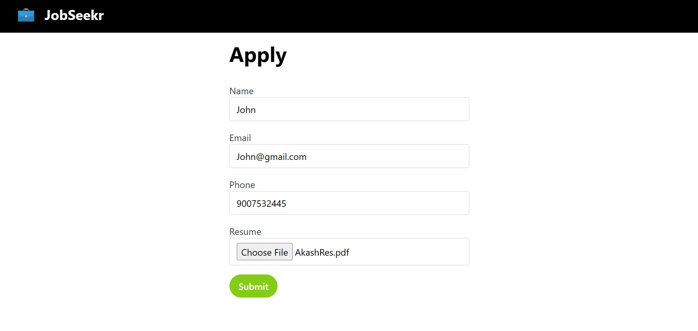

# JobSeekr - MERN Stack Job Board App

JobSeekr is a full-stack web application that allows users to browse and apply for job listings. It provides a platform for employers to post job openings and for job seekers to search for and apply to those jobs.

## Screenshots








## Features

- Browse job listings.
- Apply for jobs by submitting your resume and application details.
- Employers can post job listings.
- User authentication and authorization.
- Responsive and user-friendly design.

## Technologies Used

- **Frontend**:

  - React
  - Vite
  - Redux for state management
  - React Router for navigation
  - Axios for making HTTP requests
  - Tailwind CSS for styling

- **Backend**:
  - Node.js with Express.js
  - MongoDB for the database
  - Mongoose as the ODM (Object Data Modeling)
  - CORS handling

## JobSeekr API Documentation (https://documenter.getpostman.com/view/23950566/2s9YRCXrF1)

## Getting Started

1. Clone the repository:

   ```bash
   git clone https://github.com/AKASH-PRASAD7/JobSeekr.git
   cd jobseekr
   ```

2. Install dependencies:

   ```bash
   cd client
   npm install
   cd ../server
   npm install
   ```

3. Set up environment variables:

   - Create a `.env` file in the `server` directory and add your MongoDB connection string and JWT secret:
     ```env
     MONGODB_URI=your_mongodb_uri
     ```

4. Start the development servers:

   ```bash
   # In the client directory
   cd client
   npm start

   # In the server directory
   cd server
   npm start
   ```

5. Open your browser and access the app at `http://localhost:5173`.

## Project Structure

- `client`: Contains the frontend code.
- `server`: Contains the backend code.

## Contributing

Contributions are welcome! Please follow our [contribution guidelines](CONTRIBUTING.md).

## License

This project is licensed under the MIT License - see the [LICENSE](LICENSE) file for details.
